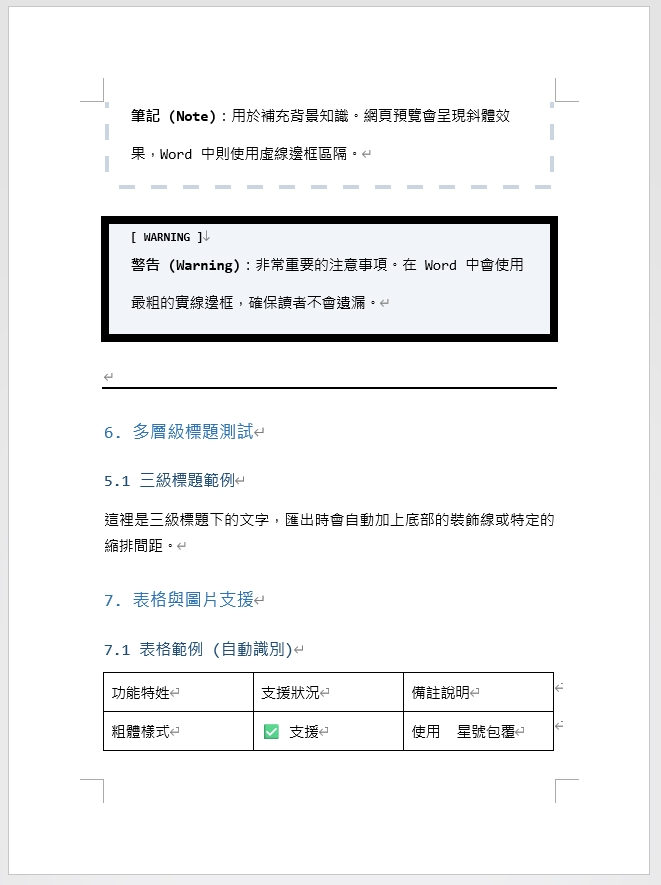
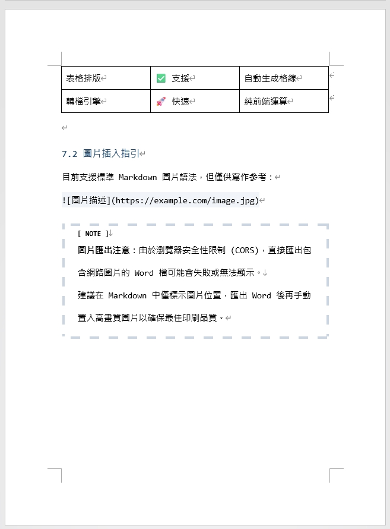

# BookPublisher MD2Docx | v1.1.1

[](https://opensource.org/licenses/MIT)
[](https://github.com/eric861129/BookPublisher_MD2Doc)

[🇹🇼 中文](README.md) | [🇺🇸 English](README_EN.md)

## If you like this project, please give it a star 🌟🌟🌟

**BookPublisher MD2Docx** is an open-source Markdown editor and converter designed specifically for **technical book authors** and **content creators**. It bridges the gap between "engineers' preferred Markdown writing" and "publishers' required Word manuscripts," allowing you to focus on content creation while automating tedious formatting work.

🔗 **Live Demo:** [https://eric861129.github.io/BookPublisher_MD2Doc/](https://eric861129.github.io/BookPublisher_MD2Doc/)

## 📄 Sample Output

You can view the exported Word document effect here:
- [📥 Download Sample File (範例Word.docx)](samples/範例Word.docx)

<div align="center">
  
  
  
  <br/>
  
  
</div>
*(Screenshot of actual Word output)*

## ✨ Features

This project is not just a Markdown converter; it is deeply optimized for "publishing" needs:

- **📚 Professional Word (DOCX) Export**
    - Automatically configures headings, paragraphs, line spacing, and borders.
    - Built-in font settings: **Microsoft JhengHei** for Chinese, **Consolas** for English/Code.
    - Supports multiple page sizes: Technical Book (17x23cm), A4, A5, B5.
    - **Automatic TOC**: Supports generating clickable Table of Contents using `[TOC]` syntax (Standard TOC field in Word).

- **💻 Enhanced Code Blocks**
    - **Automatic Line Numbers**: Line numbers displayed by default, matching IDE style (single line spacing).
    - **Language Labels**: Automatically displays language name in the top-right corner.
    - **Flexible Control**: Supports `js:ln` (force show) or `js:no-ln` (hide line numbers) syntax.

- **🔗 Smart Links (QR Code)**
    - **Auto QR Code Generation**: Markdown links `[Text](URL)` automatically generate a QR Code next to the text in the exported file.
    - **Optimized for Physical Books**: Convenient for readers to scan and jump to resources while reading printed or e-books.

- **📑 YAML Frontmatter Support**
    - **Metadata Management**: Define book title, author, and layout preferences at the beginning of the file using YAML syntax.
    - **Auto Document Properties**: Defined `title` and `author` are automatically written to Word document properties.

- **📖 Dynamic Headers & Footers**
    - **Professional Page Numbers**: Automatically inserts page numbers centered in the footer.
    - **Header Navigation**: Displays the book title automatically in the header.
    - **Flexible Toggle**: Use Frontmatter to set `header: false` or `footer: false` to enable or disable them.

- **💬 Chat Dialogues**
    - Designed for "scenario simulation" or "AI conversations" common in technical books.
    - Simply type `User:` or `AI:` to generate left/right aligned, styled dialogue boxes.

- **⚠️ Rich Callouts**
    - Supports GitHub/Obsidian style callout syntax:
    - `[!TIP]` Tip: Solid border
    - `[!NOTE]` Note: Dashed border
    - `[!WARNING]` Warning: Thick border emphasis

- **⌨️ Special Inline Styles**
    - **UI Button**: Use `【Settings】` to generate button styles.
    - **Shortcut**: Use `[Ctrl]` to generate keyboard key styles.
    - **Book Title**: Use `『Clean Code』` for automatic bolding.

- **📊 Rich Block Support**
    - **Tables**: Supports standard Markdown table syntax, auto-generating bordered Word tables.
    - **Ordered Lists**: Supports `1.` `2.` with automatic numbering.

- **👁️ WYSIWYG**
    - Dual-column mode: Writing on the left, real-time preview on the right.
    - **Editor Optimization**: Supports `Tab` indentation (inserts spaces) without losing focus.

## 🚀 Getting Started

### Prerequisites
- [Node.js](https://nodejs.org/) (v16+ recommended)

### Installation & Running

1. **Clone the Project**
   ```bash
   git clone https://github.com/your-username/BookPublisher_MD2Doc.git
   cd BookPublisher_MD2Doc
   ```

2. **Install Dependencies**
   ```bash
   npm install
   ```

3. **Run Dev Server**
   ```bash
   npm run dev
   ```
   The browser will automatically open `http://localhost:5173`.

## 📝 Syntax Guide

This project uses a custom Regex-based parser optimized for technical manuscript formatting needs.

### Support Matrix

| Type | Status | Example / Note |
| :--- | :--- | :--- |
| **Headings** | ✅ Full | `# H1` to `### H3` (Mapped to Word Heading levels) |
| **Paragraphs** | ✅ Full | Standard text and line breaks |
| **Code Blocks** | ✅ Full | ```lang:ln/no-ln``` (Line numbers & Language tags) |
| **Bullet Lists** | ✅ Basic | Starts with `-` or `*` (Nested lists not supported yet) |
| **Ordered Lists** | ✅ Basic | Starts with `1.` (Converts to Word numbered lists) |
| **Tables** | ✅ Basic | Standard Markdown tables (No line breaks in cells) |
| **Chat Dialogues** | 🌟 Special | `Role "::` (Left), `Role ::"` (Right), `Role :":` (Center) |
| **Callouts** | 🌟 Special | `> [!TIP]`, `> [!NOTE]`, `> [!WARNING]` |
| **Auto TOC** | 🌟 Special | `[TOC]` syntax |
| **Smart Links** | 🌟 Special | `[Text](URL)` (Auto-generates QR Code) |
| **Inline Styles** | ✅ Partial | `**Bold**`, `*Italic*`, `『Book』`, `【Button】`, `[Key]` |
| **Horizontal Rule** | ✅ Full | `---` or `***` (Converts to Word divider) |

> ⚠️ **Limitations**:
> The current parser uses line-by-line scanning, so support for **complex nested structures** (e.g., tables inside lists, or code blocks inside quotes) is weak. If your manuscript contains complex nesting, it is recommended to fine-tune in Word after export. We plan to introduce AST (Abstract Syntax Tree) to solve this in the future.

## 🎨 Customization

This project supports high customization. You can adjust fonts, colors, or add Markdown syntax based on your needs. For details, please refer to:
- [📘 Customization Guide (CUSTOMIZATION.md)](CUSTOMIZATION.md)

## 🛠️ Tech Stack

- **Frontend Framework**: [React 19](https://react.dev/) (Hooks-based Modular Architecture)
- **Build Tool**: [Vite 6](https://vitejs.dev/)
- **Design System**: Centralized Theming System (`theme.ts`)
- **Language**: [TypeScript](https://www.typescriptlang.org/)
- **Document Generation**: [docx](https://docx.js.org/)
- **UI Icons**: [Lucide React](https://lucide.dev/)

## 🤝 Contributing

Contributions are welcome! If you find a bug or have a feature suggestion:

1. Fork this project
2. Create your Feature Branch (`git checkout -b feature/AmazingFeature`)
3. Commit your changes (`git commit -m 'Add some AmazingFeature'`)
4. Push to the branch (`git push origin feature/AmazingFeature`)
5. Open a Pull Request

## 📄 License

This project is licensed under the MIT License - see the [LICENSE](LICENSE) file for details.
